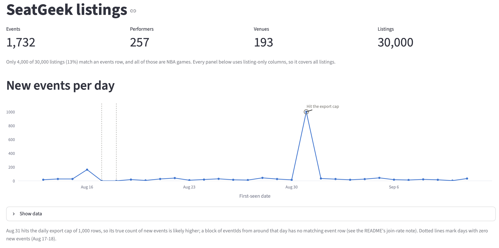
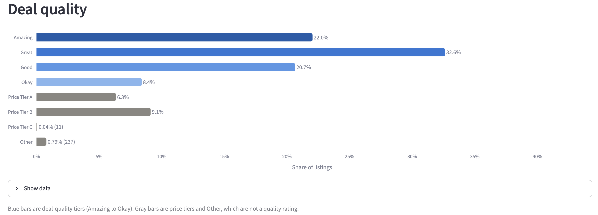
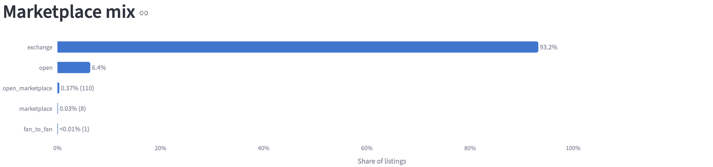
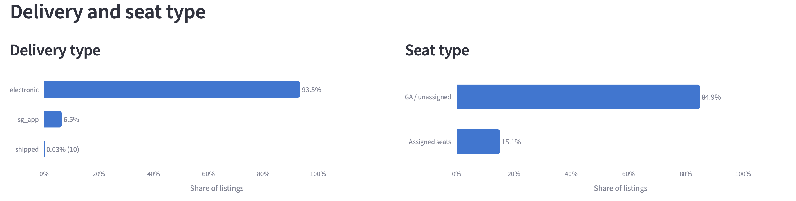
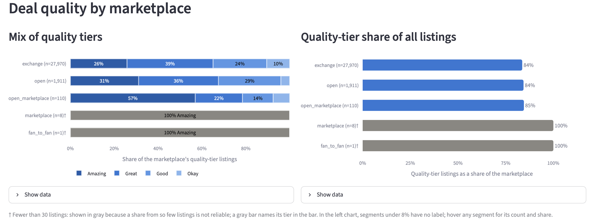

# SeatGeek Analysis



<details>
<summary>More screenshots</summary>






</details>

## Data

The data is the free preview sample of the [SeatGeek dataset](https://rebrowser.net/products/datasets/seatgeek) published by Rebrowser. The full field reference, distributions and license terms are in [data/raw/DATASET_README.md](data/raw/DATASET_README.md).

The raw data files (parquet/csv) in `data/raw/` are git-ignored; that reference file and each table's `schema.json` are tracked. To reproduce, download the dataset from Rebrowser ([GitHub](https://github.com/rebrowser/seatgeek-dataset), [HuggingFace](https://huggingface.co/datasets/rebrowser/seatgeek-dataset) or [Zenodo](https://doi.org/10.5281/zenodo.18854665)) into `data/raw/`.

| Table | Folder | Layout | Raw rows (before dedup) |
| --- | --- | --- | --- |
| Events | `events/` | one file per day, last 30 days | 1,733 |
| Event listings | `event-listings/` | one file per day, up to 1,000 rows each, last 30 days | 30,000 |
| Performers | `performers/` | single file | 257 |
| Venues | `venues/` | single file | 193 |

## Key findings

**Market structure is concentrated and mostly digital.** `exchange` accounts for 93.2% of all listings — the resale activity in this sample funnels through one channel. Ticketing has largely moved past physical delivery: 93.5% of listings are electronic, versus 0.03% (10 listings) still shipped. GA/unassigned listings (84.9%) outnumber specific assigned seats more than 5 to 1.

**Marketplace choice barely predicts deal quality.** Across the three marketplaces with meaningful volume, the share of listings in a genuine quality tier (Amazing/Great/Good/Okay) is nearly identical: `exchange` 84%, `open` 84%, `open_marketplace` 85%. Whatever drives deal quality in this sample, it isn't which marketplace the listing sits on.

**The low events-listings join rate has a specific, traceable cause.** Only 13% of listings (4,000 of 30,000) match an event record, and every matched event is an NBA game. Tracing the unmatched event IDs shows this isn't random: a daily export on Aug 31 hit its 1,000-row cap mid-batch, and roughly 72% of the unmatched IDs cluster in one contiguous block from that day — visible directly as the spike in "New events per day" on the dashboard. The rest are events first seen before this sample's 30-day window began.

**This sample's category shares diverge from the full dataset's published baselines**, likely due to day-to-day sampling variance rather than an error (verified against raw parquet and CSV): electronic delivery is 93.5% here versus 80.8% in the full 98.7M-row dataset, and assigned-seat share is 15.1% versus a 23% fill rate. Treat this sample's percentages as descriptive of these 30,000 rows, not as an estimate of the full dataset.

**Aside (not shown on the dashboard):** within the 4,000 listings that do join to an event — all NBA — Cleveland (1,103 listings), the Lakers (735), and Dallas (708) lead in listing volume. Interesting, but it reflects NBA demand specifically, not the marketplace as a whole, so it's called out here rather than presented as a general "top performers" panel.

Things to know:

- **Sample, not the full dataset.** Listings are 0.03% of the 98.7M full records, and their category shares differ a lot from the full-dataset figures on the Rebrowser page. Here `sg_app` delivery is 6.5% (19.0% in the full dataset), `electronic` is 93.5% (80.8%), `exchange` is 93.2% (97.3%), and listings with assigned seats are 15.1% (23% fill rate). This is not a code error: the seats counts match when read directly from the parquet and CSV files, and the daily shares swing widely (assigned seats range from 0.9% to 100% per day), most likely because each day's 1,000 listings come from a small set of events (555 distinct events across 30 days). Do not compare dashboard percentages to the full-dataset baseline.
- **Most listings do not join to an event.** Only 32 of the 555 distinct `eventId`s in listings appear in the events table, which is 4,000 of 30,000 listings (13%). The other 523 `eventId`s (26,000 listings) have no event row, so no type, venue or performer. This is inferred from the data patterns, not confirmed:
  - **Truncated export day.** 1,000 events were first seen on 2026-08-31, exactly the "up to 1,000 rows per day" cap, while every other day has 162 or fewer. 377 of the unmatched `eventId`s form one contiguous block (18376000-18379100) with zero events in the table, which fits rows cut off by that cap. More days would not recover them.
  - **Events older than the window.** Only the last 30 days are retained (2026-08-13 to 2026-09-11), so events first seen earlier are missing. Unmatched IDs such as 17565118 fit this case.
  - **The match is all-or-nothing by day.** On 26 of 30 days no listing matches an event; on the other 4, every listing does.

  Any analysis that needs event context (type, venue, performer) should use only the 4,000 matched listings. All 32 matched events are NBA games with exactly two performers, so event-level results cannot compare sports. Listing-only analysis (`dealBucket`, `marketplace`, `deliveryType`, section, quantity) can use all 30,000.
- **Premium fields are masked.** Columns marked 🔒 (listing `price`, `priceWithFees`, `fee`, `dealScore`; event price and count fields; performer image URLs) contain only `[PREMIUM]`. `src/clean.py` drops them. Deal quality comes from `dealBucket` instead.

### License and citation

Free for research and non-commercial use with attribution. Cite as: Rebrowser, *SeatGeek Events & Ticket Listings Dataset*, 2026, https://rebrowser.net/products/datasets/seatgeek. See the [license terms](https://rebrowser.net/free-datasets-for-research#license).

## Run

```bash
python3 -m venv .venv
source .venv/bin/activate
pip install -r requirements.txt
streamlit run dashboard/app.py
```

Activate the virtual environment first. If `streamlit` resolves to another install (for example Anaconda's older version), the dashboard fails with a `TypeError`; `python -m streamlit run dashboard/app.py` inside the venv always uses the right one.
